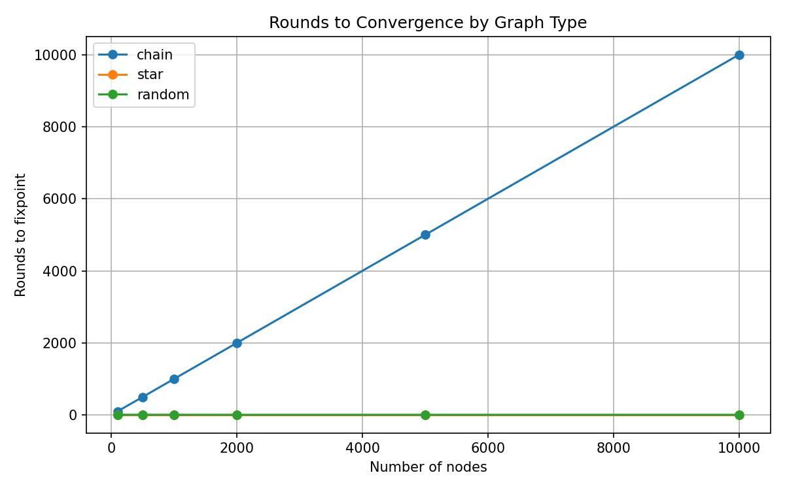
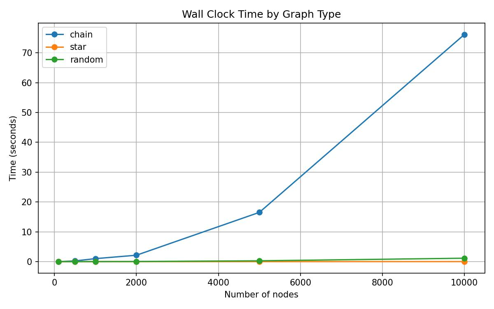

# proof-star-convergence

Formal verification of the Large Star / Small Star connected components algorithm in Rocq.
The two parts are independent but tell a complete story together.
For more detail on each part, see the individual READMEs inside `rocq/` and `spark/`.

---

## Why This Matters

Connected components is not an academic toy problem. It is one of the core
primitives in large scale graph processing at companies like LinkedIn, Twitter,
and Facebook. LinkedIn uses it to power the "People You May Know" feature:
finding everyone in your extended professional network means finding all nodes
in the same connected component of a graph with hundreds of millions of nodes.
Twitter uses it for community detection and to identify clusters of related
accounts. Facebook runs it as part of their social graph analysis pipeline.


- The Large Star / Small Star algorithm is what LinkedIn actually deployed for this problem at scale.
- This project formally verifies its correctness in Rocq.
- The proof gives a machine-checked guarantee that the algorithm produces the right answer at fixpoint, for any graph, not just the ones you tested.

---

## Repository Structure

```
proof-star-convergence/
├── rocq/
│   └── ConnectedComponents.v   # full Rocq proof: definitions, lemmas, theorems
├── spark/
│   ├── benchmark.ipynb          # PySpark benchmark notebook (Google Colab)
│   ├── results.csv              # raw convergence data across all graph types and sizes
│   └── results/
│       ├── rounds_convergence.jpeg   # rounds to fixpoint by graph type
│       └── wall_clock_time.jpeg      # wall clock time by graph type
├── LICENSE
└── README.md
```

---

## The Algorithm

The Large Star / Small Star algorithm is a distributed connected components algorithm designed for large graphs. Each node repeatedly adopts the minimum label among its neighbors, falling back to its own id if it has no neighbors. After enough rounds, the labels stabilize and every node in the same connected component shares the same label.

The key question the proof addresses is: when the labels stop changing, are they actually correct? This is not obvious. The algorithm is iterative and distributed, and it is not immediately clear that the fixpoint it reaches reflects the true connected component structure of the graph.

---

## Rocq Proof

The proof is in `rocq/ConnectedComponents.v`. A graph is modeled as a list of undirected edges over `nat`. One round of the algorithm is `apply_star`, which maps every edge endpoint to its current label. The algorithm runs until `apply_star g = g`, which is the fixpoint condition.

The core definitions are:

```coq
Definition graph := list (nat * nat).

Fixpoint neighbors (n : nat) (g : graph) : list nat := ...

Definition label_of (n : nat) (g : graph) : nat :=
  list_min (neighbors n g) n.

Definition apply_star (g : graph) : graph :=
  map (update_edge g) g.
```

Reachability is defined as an inductive proposition:

```coq
Inductive connected (g : graph) : nat -> nat -> Prop :=
  | conn_refl  : forall u, connected g u u
  | conn_edge  : forall u v, (In (u, v) g \/ In (v, u) g) -> connected g u v
  | conn_trans : forall u w v,
      connected g u w -> connected g w v -> connected g u v.
```

The main theorems proved are:

> **Theorem 1.** `fixpoint_same_label`. At fixpoint, for any edge `(u, v)` in the graph, `label_of u g = label_of v g`.

> **Theorem 2.** `fixpoint_correct`. At fixpoint, if `label_of u g = label_of v g` then `connected g u v`.

> **Theorem 3.** `fixpoint_iff`. At fixpoint, `label_of u g = label_of v g` if and only if `connected g u v`. This is the full biconditional combining both directions.

Supporting lemmas include `fixpoint_labels_stable` (at fixpoint every node label equals the node id itself), `connected_sym` (reachability is symmetric), `isolated_label` (isolated nodes label themselves), and several helper lemmas for `list_min` and neighbor membership.

---

## Empirical Benchmark

The benchmark is in `spark/benchmark.ipynb` and runs the same algorithm in Python across three graph types and six sizes (100 to 10000 nodes).

**Chain** `0 -- 1 -- 2 -- ... -- n`. The worst case. The minimum label can only travel one hop per round, so a chain of $n$ nodes takes $n - 1$ rounds to converge. This is the theoretical upper bound for this class of algorithm.

**Star.** One center node connected to all others. Every non-center node sees node 0 as a neighbor in the first round, so all labels become 0 immediately. Converges in 2 rounds regardless of size.

**Random.** Erdos-Renyi $G(n, p)$ with $p = 0.01$. Short paths everywhere mean the minimum label propagates quickly. Converges in 4 to 6 rounds across all sizes tested.

### Results


Rounds to fixpoint across chain, star, and random graphs from 100 to 10000 nodes.


Wall clock time in seconds across the same graphs and sizes.

| graph | nodes | rounds | time (s) |
|-------|-------|--------|----------|
| chain | 100 | 100 | 0.013 |
| chain | 500 | 500 | 0.239 |
| chain | 1000 | 1000 | 1.002 |
| chain | 2000 | 2000 | 2.146 |
| chain | 5000 | 5000 | 16.526 |
| chain | 10000 | 10000 | 76.179 |
| star | 100 | 2 | 0.000 |
| star | 500 | 2 | 0.001 |
| star | 1000 | 2 | 0.001 |
| star | 2000 | 2 | 0.003 |
| star | 5000 | 2 | 0.007 |
| star | 10000 | 2 | 0.011 |
| random | 100 | 6 | 0.000 |
| random | 500 | 5 | 0.003 |
| random | 1000 | 5 | 0.012 |
| random | 2000 | 4 | 0.043 |
| random | 5000 | 4 | 0.270 |
| random | 10000 | 4 | 1.146 |

The Rocq proof guarantees that whatever round count appears in this table, the labels at that point correctly identify connected components. The benchmark shows that in practice, for any graph that is not a pathological chain, convergence is fast.

---

## Tools

- [Rocq](https://rocq-prover.org/) (formerly Coq)
- [PySpark](https://spark.apache.org/docs/latest/api/python/)
- [Google Colab](https://colab.research.google.com/)

---

## References

Rastogi, A., Macko, M., & Leskovec, J. (2013). Processing large graphs using the "Large Star, Small Star" algorithm. In *Proceedings of the VLDB Endowment*. [https://dl.acm.org/doi/10.14778/2556549.2556577](https://dl.acm.org/doi/10.14778/2556549.2556577)
