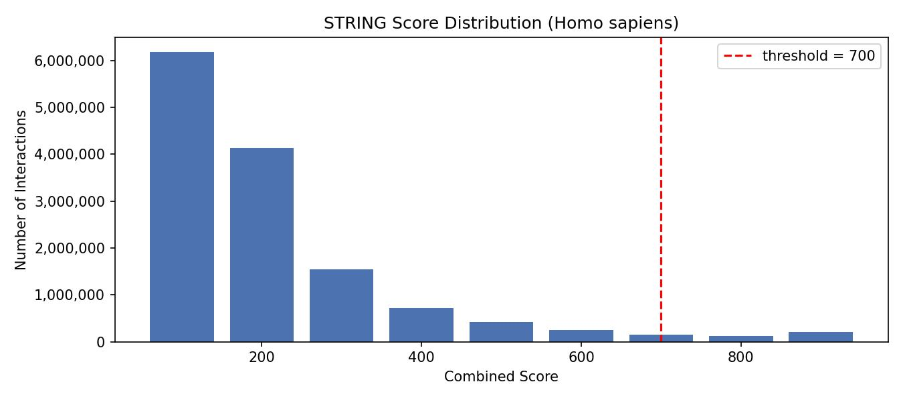
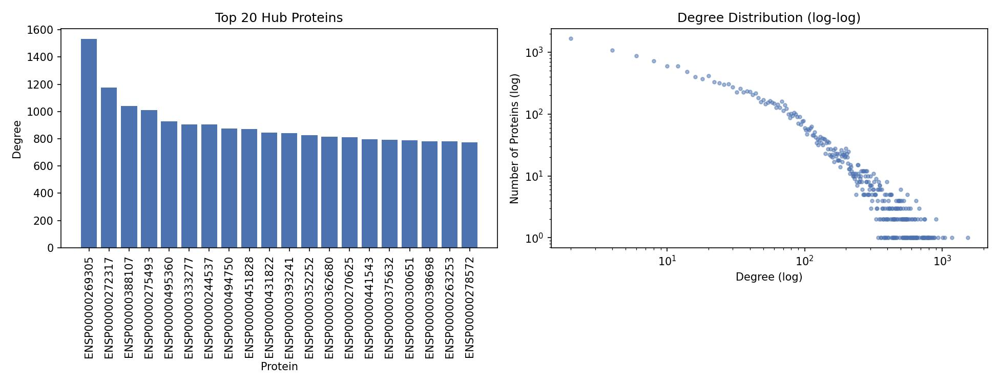
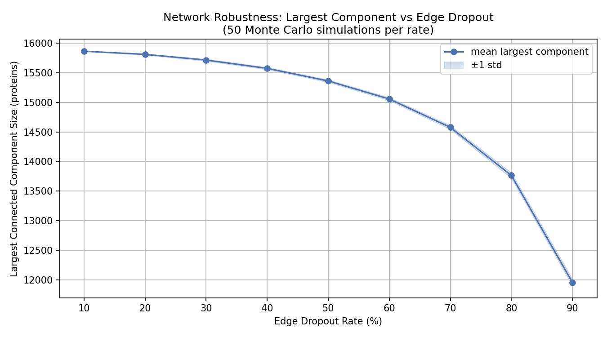
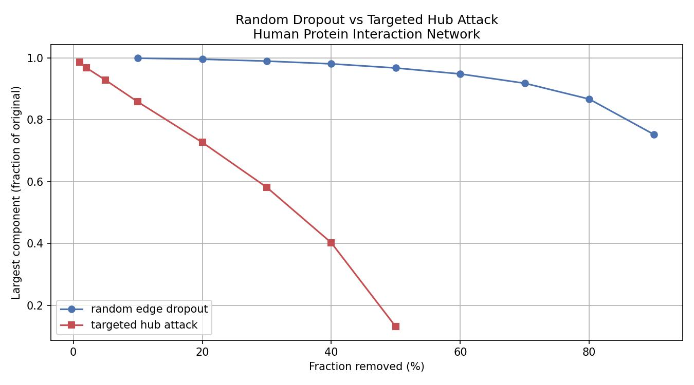
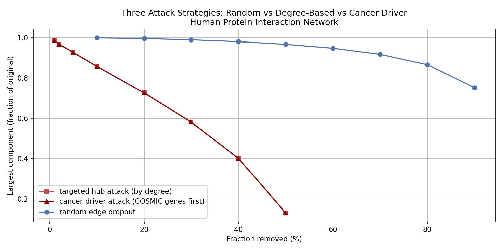
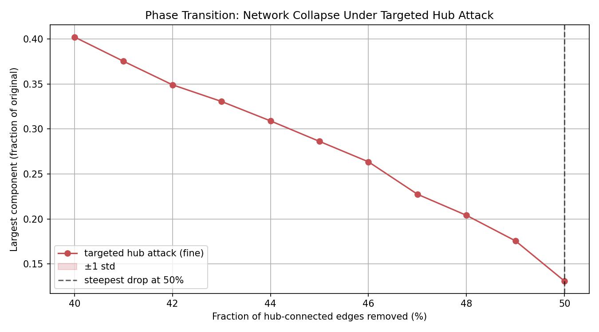

# spark

This folder contains the PySpark pipeline notebook for the STRING protein interaction
network analysis. The notebook downloads the dataset, runs the full pipeline end to
end, and produces all plots and CSVs in one session on Google Colab. Every code cell
has a markdown cell above it explaining what the step does and why it is done that way.

---

## Dataset

The STRING database provides protein-protein interaction networks for thousands of
organisms. Each interaction gets a combined score from 0 to 1000 based on experimental
evidence, co-expression, text mining, and computational prediction. We use version 12.0
of the *Homo sapiens* network.

| Field | Detail |
|---|---|
| Source | https://string-db.org/cgi/download |
| File | `9606.protein.links.v12.0.txt.gz` |
| Format | Space-separated text, gzipped |
| Columns | `protein1`, `protein2`, `combined_score` |
| Raw interactions | 13,715,651 |
| After filtering (score >= 700) | 473,860 edges, 16,201 proteins |

The file is downloaded directly inside the notebook using `urllib.request` and read
into Spark natively from the gzipped format without any intermediate decompression step.

---

## Platform

Google Colab (free tier). PySpark is installed at runtime inside the notebook. No
local setup or cluster is required. The Spark session runs in `local[*]` mode, which
uses all available CPU cores on the Colab machine for parallel operations.

---

## Dependencies

```
pip install pyspark
```

All other libraries used (pandas, matplotlib, urllib, collections, random, time) are
available by default in the Colab environment.

---

## Workflow

**Step 1: Initialize Spark**

```python
from pyspark import SparkContext, SparkConf
from pyspark.sql import SparkSession

conf = SparkConf().setAppName("string-robustness").setMaster("local[*]")
sc = SparkContext(conf=conf)
spark = SparkSession(sc)
sc.setLogLevel("ERROR")
```

Starts a Spark session in local mode using all available CPU cores. `local[*]` is
what makes all subsequent parallel operations actually run concurrently rather than
sequentially. The log level is set to ERROR so Spark's verbose internal logging does
not clutter the notebook output.

---

**Step 2: Download the dataset**

```python
import urllib.request

urllib.request.urlretrieve(
    "https://stringdb-downloads.org/download/protein.links.v12.0/9606.protein.links.v12.0.txt.gz",
    "string_raw.txt.gz"
)
```

Downloads the gzipped interaction file directly to the Colab runtime filesystem.
Takes roughly 5 to 10 seconds. Storing it as a `.gz` file lets Spark read it natively
in the next step without a separate decompression step.

---

**Step 3: Define schema and ingest into Spark**

```python
from pyspark.sql.types import StructType, StructField, StringType, IntegerType

schema = StructType([
    StructField("protein1", StringType(), False),
    StructField("protein2", StringType(), False),
    StructField("combined_score", IntegerType(), False),
])

df_raw = spark.read \
    .option("sep", " ") \
    .option("header", "true") \
    .csv("string_raw.txt.gz", schema=schema)

df_raw.cache()
print(f"total edges (raw): {df_raw.count():,}")
```

Spark reads the gzipped file in parallel across its worker threads with an explicit
schema so type inference is skipped entirely. The raw DataFrame is cached in memory
because multiple downstream operations read from it, and without caching Spark would
re-read and re-parse the file from disk each time.

---

**Step 4: Filter to high-confidence interactions**

```python
CONFIDENCE_THRESHOLD = 700

df = df_raw.filter(F.col("combined_score") >= CONFIDENCE_THRESHOLD)
df.cache()

print(f"edges after filtering: {df.count():,}")
```

Removes 96% of raw interactions and keeps only those scoring 700 or above. This
threshold corresponds to high-confidence evidence in STRING's scoring scheme. The
filtered DataFrame is cached separately because all network analysis steps downstream
read from it repeatedly.

---

**Step 5: Score distribution plot**

```python
score_dist = df_raw.groupBy(
    (F.col("combined_score") / 100).cast(IntegerType()).alias("score_bin")
).count().orderBy("score_bin").toPandas()
```

Groups all 13.7 million raw interactions into score bins of width 100 and counts each
bin in parallel. The resulting bar chart shows where the confidence threshold sits
relative to the full distribution and confirms the filtering step is meaningful rather
than arbitrary. Saved as `score_distribution.jpeg`.

---

**Step 6: Degree distribution**

```python
degree = (
    df.select(F.col("protein1").alias("protein"))
    .union(df.select(F.col("protein2").alias("protein")))
    .groupBy("protein")
    .count()
    .withColumnRenamed("count", "degree")
)
degree.cache()
```

Computes degree in parallel by stacking both protein columns into one and grouping by
protein name. Each Spark partition counts independently and the results are aggregated
across partitions. The log-log plot of the degree distribution confirms a power-law,
meaning a small number of proteins interact with hundreds of others while most interact
with only a few. This is the defining property of a scale-free network. Saved as
`degree_distribution.jpeg`.

---

**Step 7: Connected components**

```python
def run_connected_components(edges):
    all_nodes = set()
    for u, v in edges:
        all_nodes.add(u)
        all_nodes.add(v)
    node_labels = {n: n for n in all_nodes}
    rounds = 0
    while True:
        new_labels = dict(node_labels)
        for u, v in edges:
            m = min(node_labels[u], node_labels[v])
            if new_labels[u] > m:
                new_labels[u] = m
            if new_labels[v] > m:
                new_labels[v] = m
        rounds += 1
        if new_labels == node_labels:
            break
        node_labels = new_labels
    return node_labels, rounds
```

This is the Large Star / Small Star algorithm, the same one formally verified in
`rocq/ConnectedComponents.v`. Protein string identifiers are mapped to integers before
running so that `min()` does numeric comparison rather than lexicographic string
comparison. The algorithm converges in 12 rounds and identifies that 15,882 of 16,201
proteins form a single giant connected component, with the remaining 319 in small
isolated clusters.

---

**Step 8: Random Monte Carlo simulations**

```python
def simulate_dropout(args):
    edges, dropout_rate, seed = args
    random.seed(seed)
    kept = [e for e in edges if random.random() > dropout_rate]
    labels, _ = run_connected_components(kept)
    components = get_components(labels)
    largest = max(len(v) for v in components.values())
    return dropout_rate, seed, largest

tasks_rdd = sc.parallelize(tasks, numSlices=len(dropout_rates))
results = tasks_rdd.map(simulate_dropout).collect()
```

Distributes 450 simulations (9 dropout rates x 50 seeds) across Spark workers using
`sc.parallelize`. Each simulation independently removes a random fraction of edges and
reruns connected components. Because each task is independent there is no communication
between workers, making this embarrassingly parallel. Every result carries a correctness
guarantee from the Rocq proof. Results saved as `mc_simulation_results.csv` and plotted
as `robustness_curve.jpeg`.

---

**Step 9: Targeted hub attack simulations**

```python
nodes_by_degree = [node for node, _ in degree_count.most_common()]

def simulate_targeted_dropout(args):
    edges, fraction_removed, seed = args
    n_hubs = int(len(nodes_by_degree) * fraction_removed)
    hubs_to_remove = set(nodes_by_degree[:n_hubs])
    kept = [e for e in edges if e[0] not in hubs_to_remove
                             and e[1] not in hubs_to_remove]
    labels, _ = run_connected_components(kept)
    components = get_components(labels)
    largest = max(len(v) for v in components.values())
    return fraction_removed, seed, largest
```

Removes edges connected to the highest-degree proteins first, in degree order. Run
in parallel across Spark workers the same way as the random simulations. The resulting
curve collapses to 13% of original network size by 50% removal, compared to 75%
retained under random dropout at 90%. Saved as `targeted_vs_random.jpeg`.

---

**Step 10: Cancer driver attack simulations**

```python
cancer_drivers = {"TP53", "EGFR", "AKT1", "CTNNB1", "MYC", "KRAS", ...}
cancer_first_order = cancer_driver_list + remaining_by_degree

def simulate_cancer_attack(args):
    edges, fraction_removed, seed = args
    n_remove = int(len(cancer_first_order) * fraction_removed)
    nodes_to_remove = set(cancer_first_order[:n_remove])
    kept = [e for e in edges if e[0] not in nodes_to_remove
                             and e[1] not in nodes_to_remove]
    labels, _ = run_connected_components(kept)
    components = get_components(labels)
    largest = max(len(v) for v in components.values())
    return fraction_removed, seed, largest
```

Prioritizes removal of proteins from the COSMIC Cancer Gene Census before falling back
to degree ordering. Hub proteins are resolved to gene names using the STRING API to
identify which of the top-degree nodes are known cancer drivers. The cancer driver
curve sits below the degree-based curve from the very first removal fraction, meaning
these proteins are structurally more critical than their degree alone predicts. Saved
as `three_attack_comparison.jpeg`.

---

**Step 11: Phase transition refinement**

```python
fine_fractions = [i/100 for i in range(40, 51)]
n_fine = 20

fine_tasks = [
    (edges_as_ints, frac, seed)
    for frac in fine_fractions
    for seed in range(n_fine)
]

tasks_rdd = sc.parallelize(fine_tasks, numSlices=len(fine_fractions))
fine_results = tasks_rdd.map(simulate_targeted_dropout).collect()
```

Re-runs the targeted hub attack at 1% intervals from 40% to 50% removal using 20
simulations per fraction point. This narrows down the region of steepest network
collapse. The steepest single-step drop is detected automatically and marked on the
plot with a vertical dashed line. Saved as `phase_transition.jpeg`.

---

## Results


96% of raw interactions fall below the confidence threshold of 700. The filter keeps
only the well-evidenced tail of the distribution.


Power-law degree distribution on log-log axes confirms a scale-free network. Top hub
is ENSP00000269305 (TP53) with degree 1537, interacting with nearly 10% of all
proteins in the high-confidence network.


At 90% random edge dropout the giant component retains 75% of proteins, showing high
resilience to random disruption.


Degree-based hub attack collapses the network to 13% by 50% removal. Random dropout
at the same fraction barely moves the curve.


Cancer driver proteins (COSMIC) cause faster fragmentation than the most connected
proteins overall, starting from the very first removal fraction.


The network declines approximately linearly from 40% to 50% hub removal. Steepest
single-step drop is at 50%.

---

## Notebook

The notebook `string_pipeline.ipynb` is fully documented. Every code cell is preceded
by a markdown cell that explains what the step does, what Spark operation makes it
distributed, and what the output means biologically. The biological interpretation cell
at the end connects all findings into a single narrative covering network topology,
drug discovery implications, and the role of the formal correctness proof.

---

## References

Szklarczyk, D., et al. (2023). The STRING database in 2023. *Nucleic Acids Research*,
51(D1), D638-D646. https://doi.org/10.1093/nar/gkac1000

Forbes, S. A., et al. (2017). COSMIC: somatic cancer genetics at high-resolution.
*Nucleic Acids Research*, 45(D1), D777-D783. https://doi.org/10.1093/nar/gkw1121

Jeong, H., et al. (2001). Lethality and centrality in protein networks. *Nature*,
411(6833), 41-42. https://doi.org/10.1038/35075138

---
